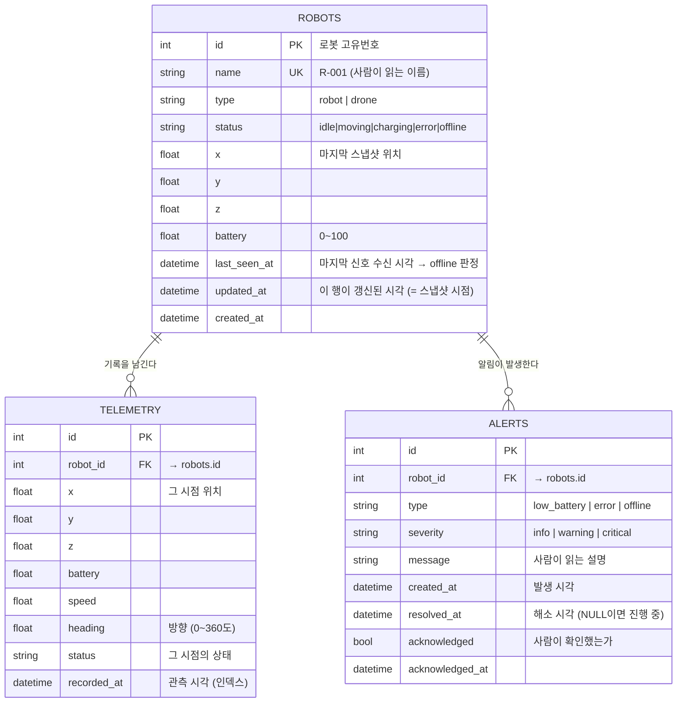

# FleetOps ERD (2주차)

> 서비스 정의 → ERD → 구현 순서의 두 번째 단계.
> **모든 컬럼은 유스케이스에서 유도합니다.** "있으면 좋을 것 같아서" 넣은 컬럼은 없어야 합니다.

---

## 0. 출발점 — 유스케이스와 필요한 데이터

| # | 유스케이스 | 필요한 것 | 어디에 |
|---|---|---|---|
| 1 | 전체 로봇을 실시간 3D로 본다 | 지금 이 순간의 위치·상태 | **메모리** (DB 아님) |
| 2 | 로봇 하나를 골라 상세를 본다 | 그 로봇의 정체성 + 현재 상태 | `robots` |
| 2' | 그 로봇의 과거 이동 기록을 본다 | 시간별 위치·배터리 | `telemetry` |
| 3 | 문제를 알아챈다 | 규칙 위반 감지 결과 | `alerts` |
| 4 | 알림을 확인 처리한다 | 읽음 여부 | `alerts` |

**유스케이스 1이 DB에 없다는 게 이 설계의 핵심입니다.** 실시간 화면은 메모리 + WebSocket으로만 돌고, DB는 "새로고침해도 남아야 하는 것"만 담당합니다.

---

## 1. ERD



**관계 읽는 법**: `||--o{` 는 **1 : N**입니다.
로봇 하나(`||`)에 텔레메트리 기록 여러 개(`o{`)가 딸립니다. `o`는 "0개일 수도 있음" — 방금 등록한 로봇은 기록이 아직 없으니까요.

---

## 2. 테이블별 설계 근거

### 2-1. `robots` — 로봇의 정체성 + 최신 스냅샷

행 개수가 **1,000개로 고정**되는 유일한 테이블입니다. 절대 커지지 않아요.

| 컬럼 | 왜 필요한가 |
|---|---|
| `id` | 기본키. 다른 테이블이 이걸로 참조 |
| `name` | 사람이 읽는 이름(`R-001`). **UK(유니크)** — 같은 이름 두 대 금지 |
| `type` | `robot`/`drone`. 3D에서 다른 모델로 그림 |
| `status` | 5개 중 하나 |
| `x, y, z` | **마지막 스냅샷** 위치 (실시간 아님) |
| `battery` | 마지막 스냅샷 배터리 |
| `last_seen_at` | **offline 판정의 근거** ⚠️ |
| `updated_at` | 이 행이 언제 갱신됐는지 = **스냅샷이 몇 초 전 것인지** |
| `created_at` | 등록 시각 |

#### ⚠️ `last_seen_at`이 왜 특별한가

status 5개 중 `offline`만 **로봇이 스스로 보고할 수 없는 상태**입니다.
"나 지금 통신 두절이야"를 보낼 수 있으면 그건 통신이 되는 거니까요.

그래서 서버가 **"안 들어옴"을 보고 추론**해야 합니다:

```
지금 시각 - last_seen_at > 5초  →  offline으로 판정
```

이 컬럼이 없으면 `offline` 상태를 만들어낼 방법이 아예 없습니다.
**상태 하나가 컬럼 하나를 요구한 것** — ERD가 유스케이스에서 유도된다는 좋은 예입니다.

#### `x, y, z`를 여기 두는 이유와 대가

실시간 위치는 메모리에 있는데 DB에도 두는 건 **중복**입니다. 그래도 두는 이유:

- **서버를 재시작해도 로봇들이 원점으로 순간이동하지 않음** (마지막 위치에서 이어감)
- `GET /robots` 한 방으로 전체 현황을 줄 수 있음 (`telemetry`를 뒤질 필요 없음)

대가는 **같은 정보가 두 곳에 있다**는 것. 그래서 `updated_at`을 함께 둡니다 — 이 값이 실시간이 아니라 **최대 5초 과거**임을 스키마가 스스로 말하게 하려고요.

> ❗ **함정**: 이 컬럼들을 매 tick UPDATE하면 배치 저장의 의미가 사라집니다.
> UPDATE도 INSERT와 똑같이 디스크 쓰기예요. **반드시 5초 배치 때만** 갱신합니다.

#### status를 별도 테이블로 안 만드는 이유

교과서적으로는 `statuses` 테이블을 따로 만들고 FK로 참조하기도 합니다. 여기선 안 합니다.

- 값이 **5개로 고정**이고 사용자가 추가할 일이 없음
- 별도 테이블로 만들면 조회할 때마다 **조인**이 붙음
- 파이썬 `Enum`으로 관리하면 오타는 코드 레벨에서 잡힘

**"사용자가 값을 추가할 수 있나"** 가 판단 기준입니다. 추가할 수 있으면 테이블, 개발자가 정하면 Enum.

---

### 2-2. `telemetry` — 시계열 기록

**무한히 커지는 유일한 테이블.** 5초마다 1,000행씩 늘어납니다 (1시간이면 72만 행).

| 컬럼 | 왜 |
|---|---|
| `robot_id` | **FK** → 어느 로봇의 기록인지 |
| `x, y, z` | 그 시점 위치 → 과거 이동 경로 그리기 |
| `battery` | 배터리 추이 그래프 |
| `speed, heading` | 속도·방향 (3D에서 로봇이 바라보는 각도) |
| `status` | 그 시점의 상태 |
| `recorded_at` | **관측 시각** |

#### `status`가 `robots`에도 있고 여기에도 있는데, 중복 아닌가?

중복 맞습니다. 그런데 **의미가 다릅니다.**

- `robots.status` = **지금** 상태 (계속 덮어써짐)
- `telemetry.status` = **그 시점에** 그랬다는 **기록** (절대 안 바뀜)

정규화가 금지하는 중복은 **"한 사실이 여러 곳에 있어서 고칠 때 어긋나는"** 경우입니다.
`telemetry`는 **append-only** — 한 번 쓰면 절대 수정하지 않으니 어긋날 일이 없어요.

> **시계열 테이블의 중복은 정규화 위반이 아니라 "그 시점의 사실 기록"입니다.**
> 회계 장부에 그때 가격을 적어두는 것과 같습니다. 나중에 상품 가격이 바뀌어도 과거 영수증은 안 고치죠.

#### 인덱스 — 왜 `(robot_id, recorded_at)` 순서인가

우리 주력 쿼리는 이겁니다:
```sql
SELECT * FROM telemetry
WHERE robot_id = 500 AND recorded_at > '어제'
ORDER BY recorded_at;
```

복합 인덱스는 **전화번호부**와 같습니다. `(성, 이름)` 순으로 정렬돼 있으면:
- "김씨 중 철수" → 김씨 구간으로 점프 후 그 안에서 이름 검색 ✅
- "이름이 철수인 사람 전부" → **성을 모르니 전체를 훑어야 함** ❌

`(robot_id, recorded_at)`이면 "500번 로봇" 구간으로 점프한 뒤, 그 안이 이미 시간순 정렬이라 범위 검색이 즉시 됩니다.
반대로 `(recorded_at, robot_id)`였다면 시간 범위는 좁혀지지만 그 안에서 1,000대가 뒤섞여 있어 500번만 골라내야 합니다.

**"먼저 딱 하나로 좁혀지는 컬럼을 앞에"** 가 원칙입니다.

---

### 2-3. `alerts` — 서버가 자동 생성하는 이벤트

로봇이 "나 배터리 없어!"라고 보내는 게 아닙니다. 로봇은 숫자만 보내고, **서버가 규칙으로 판정**합니다.

| 규칙 | 만들 알림 | severity |
|---|---|---|
| `battery < 20` | `low_battery` | warning |
| `battery < 5` | `low_battery` | critical |
| `status == error` | `error` | critical |
| `지금 - last_seen_at > 5초` | `offline` | critical |

#### ⚠️ 핵심 함정 — 알림 폭발

순진하게 만들면 이렇게 됩니다:

```
매 tick 검사: battery < 20 이면 알림 생성
→ 배터리 19%가 30초 지속
→ 초당 10 tick × 30초 = 알림 300개 💥
```

**해결: 알림은 "상태일 때"가 아니라 "상태가 바뀌는 순간"에만 만든다.**
20% 이상 → 미만으로 **넘어가는 그 한 번**만 생성합니다. (상태 전이 / edge trigger)

그러려면 **"이 로봇에 이 종류의 미해결 알림이 이미 있나?"** 를 알아야 합니다. 그래서 필요한 게:

#### `resolved_at` vs `acknowledged` — 헷갈리는 두 개

이 둘은 완전히 다릅니다. 합치면 안 돼요.

| | `resolved_at` | `acknowledged` |
|---|---|---|
| 뜻 | **문제가 해소됨** | **사람이 봤음** |
| 누가 | **서버** (조건이 풀리면 자동) | **사용자** (버튼 클릭) |
| 예 | 배터리가 25%로 회복됨 | 담당자가 "확인" 누름 |

네 가지 조합이 전부 말이 됩니다:

| 해소 | 확인 | 상황 |
|---|---|---|
| ✅ | ✅ | 정상 종료 |
| ✅ | ❌ | 저절로 풀렸는데 아무도 못 봄 |
| ❌ | ✅ | 봤지만 아직 문제 진행 중 ← **가장 흔함** |
| ❌ | ❌ | 새 알림 |

**중복 방지에 쓰는 건 `resolved_at`입니다:**
```sql
-- 이 로봇에 미해결 low_battery 알림이 있나?
SELECT 1 FROM alerts
WHERE robot_id = 500 AND type = 'low_battery' AND resolved_at IS NULL;
```
있으면 새로 안 만듭니다. 배터리가 회복되면 그때 `resolved_at`을 채웁니다.

> `acknowledged`로 중복을 막으면 **사용자가 확인 버튼을 누르는 순간 같은 알림이 또 생깁니다.**
> 흔한 버그이고, 두 개념을 안 나눴을 때 생기는 전형적인 문제입니다.

#### 기획서에서 뺀 것
- `collision_warning` — 충돌 회피는 스코프 밖이라 제거 (판정할 로직이 없음)

---

## 3. 쓰기 경로 — 이 ERD가 실제로 어떻게 채워지나

```
매 100ms (tick)          메모리만 갱신. DB 접근 0회
                         + 알림 규칙 검사 (상태 전이만)
                              │
매 5초 (배치)                 ▼
        ┌─────── 트랜잭션 1개 ───────┐
        │  telemetry  1,000행 INSERT │
        │  robots     1,000행 UPDATE │
        └────────────────────────────┘
                              │
알림 발생 시 (드묾)      alerts 1행 INSERT (즉시)
```

- `telemetry`와 `robots`를 **한 트랜잭션**으로 묶는 이유: 둘이 같은 스냅샷이어야 합니다. 따로 저장하면 "최신 telemetry ≠ robots.x"인 순간이 생겨요.
- `alerts`만 즉시 저장하는 이유: **드물게** 발생하고(초당 수만 건이 아님), 놓치면 안 되는 정보라서.

---

## 4. 남은 결정 사항

| # | 질문 | 현재 안 |
|---|---|---|
| 1 | `telemetry`가 무한히 커지는 건 어떻게? | 2주차엔 방치. 1시간 = 72만 행이면 SQLite가 버팀. **보관 주기(오래된 것 삭제)는 5주차로** |
| 2 | 로봇 삭제 시 딸린 telemetry는? | 2주차엔 삭제 기능이 없으므로 보류. FK 제약만 걸어둠 |
| 3 | 좌표계 | 창고를 100m × 100m 평면으로, `z`는 드론 고도용 |
