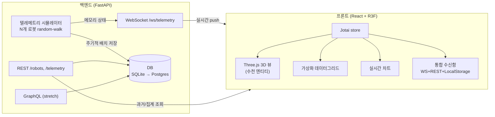

# FleetOps — 실시간 대규모 Fleet 3D 관제 대시보드 (기획서)

> 6주 스터디 겸 포트폴리오 프로젝트 · 프론트엔드 심화 + 풀스택 대비
> 작성 2026-07-24 · 도메인: 자율주행 로봇/드론 Fleet (디지털 트윈 스타일)

---

## 1. 한 줄 소개
**수천 개의 로봇/드론이 실시간으로 스트리밍하는 텔레메트리를 3D로 시각화하고, 성능을 수치로 증명하는 풀스택 관제 콘솔.**

> README/발표는 "소재(로봇)"가 아니라 **역량(대용량 실시간 3D 시각화 + 성능)** 중심으로 서술 → 어느 회사가 봐도 통하게.

## 2. 목표 (왜 만드나)
- **포트폴리오**: 프론트 채용 공고가 공통으로 원하는 것(대용량 시각화·실시간·성능 최적화·상태관리·테스트·풀스택·Docker/CI-CD)을 **한 프로젝트로 증명**.
- **학습**: FastAPI · SQLite→PostgreSQL · WebSocket · Three.js(R3F) · Docker · CI/CD · (stretch)GraphQL.
- **스터디**: 매주 "설계 결정 + AI 활용/비판 + 회고"를 GitHub Issue/MD로 기록.

## 3. 학습 대상 기술 & 왜
| 기술 | 왜 |
|---|---|
| **FastAPI** | 백엔드+시뮬레이터+WebSocket. 이미 논술메이트서 사용 → 심화 |
| **SQLite → PostgreSQL** | 가벼운 관계형 → 프로덕션 관계형 이전 경험(정합성·트랜잭션) |
| **WebSocket** | 실시간 텔레메트리 스트림 (통합 수신함) |
| **Three.js / react-three-fiber** | 3D 대용량 시각화(차별점), 성능 최적화 |
| **Jotai** | 원자적 상태 구독으로 리렌더 격리 (대규모 상태관리) |
| **Docker / docker-compose** | 로컬 개발 환경 통일 + 배포. JD 저격(채널톡 k8s, 도치 AWS) |
| **GitHub Actions CI/CD** | Vercel 없이 직접 빌드·배포 파이프라인 |
| **Vitest** | Unit Test (JD 요구) |
| **GraphQL(Strawberry)** *stretch* | REST vs GraphQL 과다수신 비교 학습 |

## 4. 아키텍처



**핵심 설계 포인트**: 실시간 위치는 **메모리(시뮬레이터)**에서 관리하고 WebSocket으로 push. DB에는 **매 tick 전량 INSERT 금지** — 일정 주기(예: 5초)로 **배치 저장/샘플링**해서 "과거 조회"용 시계열만 쌓음 (write 부하 회피 = 정합성·성능 트레이드오프의 좋은 글감).

## 5. DB 스키마 (초안)

```
robots
  id            PK
  name         
  type          # robot | drone
  status        # idle | moving | charging | error | offline
  created_at

telemetry            # 시계열, 대량 (배치 저장)
  id            PK
  robot_id      FK → robots.id        ← 참조 정합성
  x, y, z       # 3D 좌표
  battery       # 0~100
  speed, heading
  recorded_at   # 인덱스

alerts
  id            PK
  robot_id      FK → robots.id
  type          # low_battery | collision_warning | offline
  severity      # info | warning | critical
  message
  acknowledged  # bool (LocalStorage와 동기화)
  created_at
```
정합성 규칙: `telemetry.robot_id`, `alerts.robot_id`는 반드시 존재하는 로봇을 참조(FK). 배치 저장은 트랜잭션으로 묶음.

## 6. 성능 예산 (측정 목표 — "수치로 증명"의 기준)
| 지표 | 목표 |
|---|---|
| 3D 렌더 (1,000 엔티티) | **60fps** 유지 |
| 3D 렌더 (5,000 엔티티) | **≥30fps** (인스턴싱·컬링 후) |
| INP (상호작용 반응) | **< 200ms** |
| 데이터그리드 (50,000행) | 스크롤 **60fps** (가상화) |
| 초기 로드 LCP | **< 2.5s** |
| WebSocket | 초당 N업데이트 무드랍 (배칭) |
| 번들 | 예산 설정 후 회귀 방지(CI) |

> 각 주차에서 **naive 구현 baseline → 최적화 후** 를 같은 방식으로 측정해 before/after 기록. 측정: Chrome DevTools Performance, `web-vitals`, R3F `<Perf/>`(drei), 커스텀 fps 카운터.

## 7. docker-compose 구조
```
docker-compose.yml
├─ api   : FastAPI (uvicorn). 2~4주 SQLite(파일 볼륨). 개발용 hot-reload
├─ db    : PostgreSQL  ← 5주차에 추가, SQLite에서 이전
└─ web   : (배포 시) Nginx가 빌드된 정적파일 서빙  ← 6주차
```
2주차엔 `api`만으로 시작(SQLite), 5주차에 `db`(Postgres) 추가, 6주차에 `web`(Nginx) + CI/CD.

## 8. 레포 구조 (모노레포 과함 → 단순 2-폴더)
```
fleet-ops/
├─ frontend/          # Vite + React 19 + TS + Jotai + R3F + Tailwind + Vitest
│  ├─ src/
│  ├─ Dockerfile      # (6주) Nginx 서빙
│  └─ ...
├─ backend/           # FastAPI + SQLModel + 시뮬레이터
│  ├─ app/
│  ├─ Dockerfile
│  └─ ...
├─ docker-compose.yml
├─ .github/workflows/ci.yml   # (6주) 테스트→빌드→배포
└─ docs/              # 기획서 + 주차별 스터디 글
```

## 9. 기술 의사결정 & 트레이드오프 (자소서/면접 무기)
- **실시간 상태를 메모리 vs DB**: 매 tick DB 저장은 write 폭발 → 메모리 관리 + 주기적 배치. (정합성·성능)
- **SQLite로 시작**: 설치·컨테이너 없이 즉시. 나중에 Postgres로 이전하며 차이 학습.
- **3D를 DOM이 아닌 WebGL(R3F)**: 수천 엔티티를 DOM으로 그리면 리플로우 폭발 → GPU 인스턴싱.
- **상태관리 Jotai**: 원자 단위 구독으로 "한 로봇 업데이트 → 전체 리렌더" 방지.
- **Vercel 대신 직접 배포**: build·서빙·CDN을 Vercel이 숨겨주던 걸 Docker+Nginx+Actions로 직접.

## 10. 6주(2~6주차) 로드맵
| 주차 | 개발 | 스터디 글 주제 |
|---|---|---|
| 2 | FastAPI+SQLite 백엔드 골격, DB 스키마, WebSocket 시뮬레이터, docker-compose(api) | DB 스키마 설계 + SQLite 선택 + 실시간 저장 트레이드오프 |
| 3 | 프론트 실시간 파이프라인(WS→Jotai→렌더), 가상화 그리드, **baseline 측정** | 리렌더 폭발을 측정으로 규명 |
| 4 | **Three.js(R3F) 3D 뷰** — 인스턴싱·LOD·프러스텀 컬링 | 3D 대용량 렌더 최적화 before/after |
| 5 | **SQLite→Postgres 이전**(docker db) + 시계열 집계 + GraphQL(*stretch*) | SQLite vs Postgres / REST vs GraphQL |
| 6 | 통합 수신함 + **Vitest** + **Docker+Nginx+GitHub Actions 직접 배포** + 성능 리포트 + 회고 | 다중소스 i/o·직접 배포·종합 |

*시간 부족한 주는 논술메이트 실무 케이스 글로 대체 가능(스터디는 주차 독립).*

## 11. 최종 산출물
- 라이브 데모(직접 배포) + GitHub 레포
- **성능 before/after 리포트**(fps·INP·리렌더·쿼리시간)
- 6개 설계/회고 문서(스터디 글 = 포폴의 "과정" 서사)
- Unit Test + CI 배지
